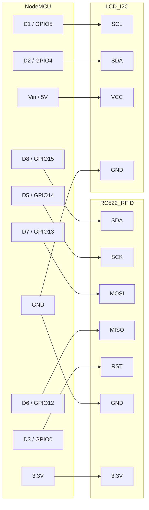

# Wiring Diagram

## Components

1.  **NodeMCU v1.0** (ESP8266)
2.  **MFRC522** RFID Reader module
3.  **16x2 LCD** with I2C Backpack

## Connection Table

| Signal | NodeMCU Pin | GPIO | Device Pin |
| :--- | :--- | :--- | :--- |
| **SPI SS (SDA)** | D8 | 15 | RC522 SDA |
| **SPI SCK** | D5 | 14 | RC522 SCK |
| **SPI MOSI** | D7 | 13 | RC522 MOSI |
| **SPI MISO** | D6 | 12 | RC522 MISO |
| **RST** | D3 | 0 | RC522 RST |
| **Power** | 3.3V | - | RC522 3.3V |
| **Ground** | GND | - | RC522 GND |
| | | | |
| **I2C SCL** | D1 | 5 | LCD SCL |
| **I2C SDA** | D2 | 4 | LCD SDA |
| **Power** | Vin (5V) | - | LCD VCC |
| **Ground** | GND | - | LCD GND |

## Diagram

